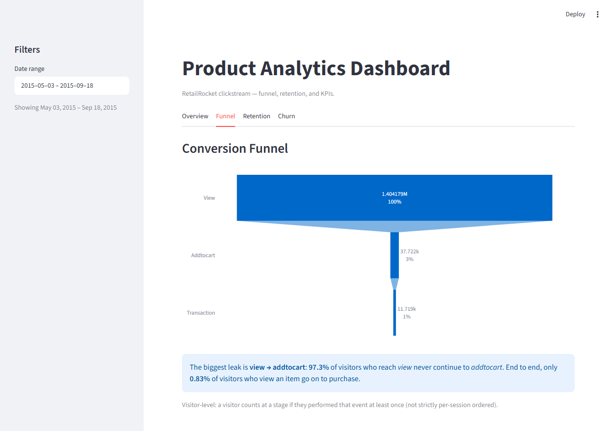

# Product Analytics Dashboard

Turns a real e-commerce clickstream (2.7M events) into product metrics —
conversion funnels, cohort retention, KPIs, and a churn model — where every
section surfaces a **plain-English insight**, not just a chart.

The funnel / cohort / KPI logic is written as pure, UI-free functions, so the
same analytics engine generalizes to any event stream (e.g. a fintech app),
not just this dataset.

**▶ Live demo: [p-analytics-dashboard.streamlit.app](https://p-analytics-dashboard.streamlit.app/)**

[](https://p-analytics-dashboard.streamlit.app/)

> The live app loads ~2.7M real events on a free-tier instance, so the first
> visit may take a moment to wake and load. If it's asleep, click "Yes, get
> this app back up!" and give it a few seconds.



## Dataset

[RetailRocket](https://www.kaggle.com/datasets/retailrocket/ecommerce-dataset)
`events.csv` — real clickstream data: `timestamp, visitorid, event, itemid,
transactionid`, where `event ∈ {view, addtocart, transaction}`.

| | |
|---|---|
| Events (after dedup) | **2,755,641** (460 exact duplicates dropped) |
| Unique visitors | **1,407,580** |
| Event mix | view 96.7% · addtocart 2.5% · transaction 0.8% |
| Date range | 2015-05-03 → 2015-09-18 (~4.5 months) |

The raw file is **large and git-ignored** — it is never committed. See
[Running locally](#running-locally) and [Deployment](#deployment) for how to
supply it.

## What's inside

| Tab | Question it answers | Sample insight (from the data) |
|---|---|---|
| **Overview** | How healthy is the funnel overall? | Acquisition is broad (~297k MAU) but only **0.83%** of visitors ever purchase and **10.2%** return on a second day — repeat engagement is the lever. |
| **Funnel** | Where do visitors drop off? | Biggest leak is **view → addtocart** (only 2.69% convert); of those who add to cart, **31%** go on to purchase. |
| **Retention** | Do cohorts come back? | On average only **~4.6%** of a week's new visitors return the following week. |
| **Churn** | Who won't come back, and why? | **95%** of first-window visitors don't return in 30 days; **recency** drives churn while **active days / breadth** drive return (ROC-AUC ≈ 0.69). |

## Metric definitions

- **Funnel** (visitor-level): a visitor "reaches" a stage if they performed
  that event at least once. Step conversion = stage / previous stage; overall =
  transaction / view.
- **Cohort retention** (weekly): a visitor's cohort is the ISO week of their
  first event; they are *retained* in week _N_ if they have **any** event that
  week. Week 0 is 100% by construction.
- **KPIs**: average **DAU/WAU/MAU** (mean distinct active visitors per
  day/week/month), **conversion rate** (visitors with ≥1 transaction / all
  visitors), and **repeat-visitor rate** (visitors active on ≥2 distinct
  calendar days / all visitors).
- **Churn** (return-prediction): observation window = first 30 days; a visitor
  active in it is labeled `churned = 1` if they have **no** event in the
  following 30 days. All features come from the observation window only (no
  leakage). A balanced logistic-regression baseline and gradient-boosted trees
  are compared on held-out ROC-AUC / PR-AUC; standardized logistic coefficients
  drive the interpretable insight.

## Project structure

```
app.py              Streamlit UI only — imports from src/
src/
  data_load.py      load + clean + validate events; resolves data source
  metrics.py        pure functions: funnel(), cohort_retention(), kpis()
  churn.py          churn dataset + model training/evaluation
data/               raw data (git-ignored, never committed)
requirements.txt    pinned dependencies
```

Metric logic stays separate from the UI and is verifiable on its own — each
`src/` module has a `__main__` that prints the numbers with internal
consistency checks:

```bash
python src/data_load.py   # sanity check: row count, visitors, event mix, dates
python src/metrics.py     # funnel / retention / KPI numbers + assertions
python src/churn.py       # churn model metrics + coefficients + insight
```

## Running locally

Requires Python 3.11+.

```bash
python -m venv .venv
# Windows:        .venv\Scripts\activate
# macOS / Linux:  source .venv/bin/activate
pip install -r requirements.txt
```

Place the RetailRocket `events.csv` in `data/` (download it from Kaggle), then:

```bash
streamlit run app.py
```

## Deployment

Live on **Streamlit Community Cloud** at
**[p-analytics-dashboard.streamlit.app](https://p-analytics-dashboard.streamlit.app/)**.

Because `data/` is git-ignored, the app fetches `events.csv` at runtime when
it isn't present locally. To reproduce the deploy:

1. Push this repo to GitHub.
2. Host `events.csv` at a direct-download URL. This project ships it as a
   gzipped [GitHub Release asset](https://github.com/Ayush05G/product-analytics-dashboard/releases/tag/data-v1)
   (`events.csv.gz`, ~33 MB vs. 90 MB raw); the loader decompresses `.gz`
   automatically.
3. In the Streamlit app's **Settings → Secrets**, add:
   ```toml
   EVENTS_URL = "https://github.com/Ayush05G/product-analytics-dashboard/releases/download/data-v1/events.csv.gz"
   ```
   (See [`.streamlit/secrets.toml.example`](.streamlit/secrets.toml.example).)
4. Deploy. The first boot downloads the file into the ephemeral `data/`;
   `@st.cache_data` keeps it warm afterward.

Resolution order is: local `data/events.csv` → `EVENTS_URL` → an actionable
error.

## Tech stack

Python · pandas · Plotly · Streamlit · scikit-learn. Exact versions are pinned
in [`requirements.txt`](requirements.txt).
